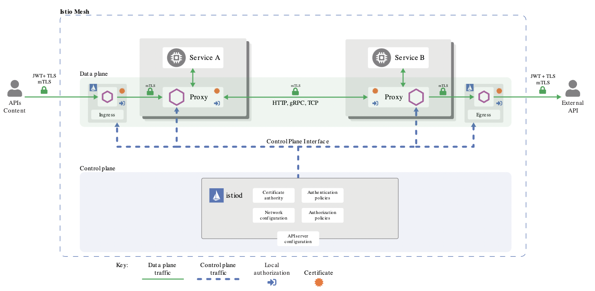
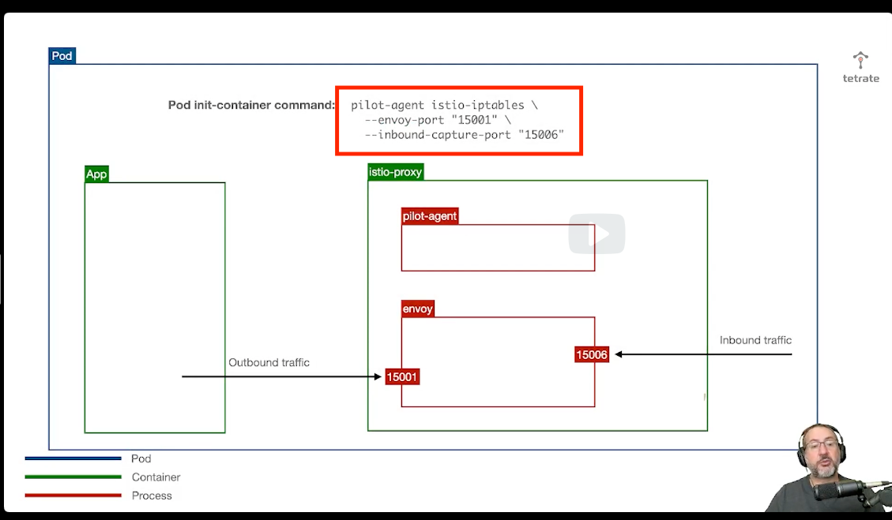

# 1 Overview of Service Mesh And Istio

## Links
- https://learning.edx.org/course/course-v1:LinuxFoundationX+LFS144x+3T2022/block-v1:LinuxFoundationX+LFS144x+3T2022+type@sequential+block@8bdd612c3a1942ba9f9f8001ffad60a9
- [Twelve-Factor App](https://12factor.net/)
- [Beyond the Twelve-Factor App](https://tanzu.vmware.com/content/blog/beyond-the-twelve-factor-app)

## Chapter Objectives
- What problems stemmed from the shift to cloud-native applications.
- How these problems were mitigated before service meshes existed.
- How service meshes address these problems.
- The design and architecture of Istio.

### 1 Shift to Cloud-Native Applications
- Businesses shifting from Monoliths to Micro-Service based architecture
- Companies shared their experience around these technologies, publishing [Twelve-Factor App](https://12factor.net/)

### 2 New Problems/Challenges Presented by New Architecture
- As codebases shrank, method calls became -> network calls
- Address of target service in an increasingly dynamic environment became difficult to resolve
- How does one service know if another is available?

#### Challenge List
1 Service discovery:
- How does a service discover the network address of other services?

2 Load balancing:
- Given that each service is scaled horizontally, the problem of load-balancing was no longer an ingress-only problem.

3 Service call handling:
- How to deal with situations where calls to other services fail or take an inordinately long time?
- An increasing portion of developers' codebases had to be dedicated to handling the failures and dealing with long response times, by sprinkling in retries and network timeouts.

4 Resilience:
- Developers had to learn (perhaps the hard way) to build distributed applications that are resilient and that prevent cascading failures.

5 Security:
- How do we secure our systems given this new architecture has a much larger attack surface?
- Can a service trust calls from other services?
- How does a service identify its caller?

6 Programming models:
- Developers began exploring alternative models to traditional multithreading to deal more efficiently with network IO (input and output, see ReactiveX).

7 Diagnosis and troubleshooting:
- Stack traces no longer provided complete context for diagnosing an issue. Logs were now distributed. How does a developer diagnose issues that span multiple microservices?

8 Resource utilization:
- Managing resource utilization efficiently became a challenge, given the larger deployment footprint of a system made up of numerous smaller services.

9 Automated testing:
- End-to-end testing became more difficult.

10 Traffic management:
- The ability to route requests flexibly to different services under different conditions started becoming a necessity.

### 3 Early Solutions

#### Netflix
- Had to rapidly move to the cloud
- Wrote many projects such as Eureka Service Registry (Service Discovery), Ribbon for client-side load-balancing, Hystrix library (for cascading failures), and Zuul Proxy for routing flexibility for bg deployments
- Spring Engineering team adapted these projects to popular Spring Framework

#### Certain Constraints were implied
- Services had to be written for JVM + had to use Spring Framework

### 4 Service Meshes

#### Lyft Approach | Service Meshes
- Route requests in/out of a given application through its proxy
- Proxy could be configured - With specific network timeouts, retry logic, circuit-breaking logic, etc.
- Security Upgrades - Connections could be upgraded from plain HTTP to encrypted traffic
- Project was open-sourced & called [`Envoy`](https://envoyproxy.io/)

#### Istio & Envoy
- Istio project was started at Google
- Envoy was the perfect building block for Istio
- Istio controlplane - Would automate configuration/synchronization of proxies deployed onto K8s as sidecars inside each Pos
- K8s API-Server - Could be leveraged to automate service discovery & communicate locations of servicew endpoints directly to each proxy

### [5 Istio Architecture](https://learning.edx.org/course/course-v1:LinuxFoundationX+LFS144x+3T2022/block-v1:LinuxFoundationX+LFS144x+3T2022+type@sequential+block@2f7c82543cee4a80bf1952bb1a1cba51/block-v1:LinuxFoundationX+LFS144x+3T2022+type@vertical+block@84321a2e1aaf49b38243e6ab18e4100f)

**Istio Basic Idea** 
- Push microservices concerns into infrastructure by leveraging Kubernetes
- Implemented by - Bundling Envoy proxy as a sidecar container directly inside every Pod

#### Istio Main Concerns
- Ensuring that each time a workload is deployed, an Envoy sidecar is deployed alongside it.
- Ensuring traffic into and out of the application is transparently diverted through the proxy.
- Assigning each workload a cryptographic identity as the basis for a more secure computing environment.
- Configuring the proxies with all the information they need to handle incoming and outgoing traffic.

### [6 Sidecar Injection](https://learning.edx.org/course/course-v1:LinuxFoundationX+LFS144x+3T2022/block-v1:LinuxFoundationX+LFS144x+3T2022+type@sequential+block@2f7c82543cee4a80bf1952bb1a1cba51/block-v1:LinuxFoundationX+LFS144x+3T2022+type@vertical+block@8605c79b427c4a0fb5bad20c47aa377c)

- **Bad Approach** - Manually modifying K8s manifests to bundle proxies as sidecars
- **Good Approach** - Automatically modifying K8s manifests to include sidecars with each pod. 2 Ways:
  - Manual Sidecar Injection
  - Automatic Sidecar Injection
  
#### Manual Sidecar Injection
1) How is Manual Sidecar Injection performed?
- `istioctl's kube-inject` subcommand automatically modifies og manifest - To include new sidecar
- Manual Sidecar Injection - `Process of altering manifests is explicit`

2) How is Automatic Sidecar Injection performed?
- `K8s Mutating Admission Webhook` - Intercepts + modifies og manifest w/ new sidecar
- Automatic Sidecar Injection - `Bundling of sidecar is made transparent to user`

3) How can you trigger the webhook? (Under Automatic Sidecar Injection) 
- Apply `istio-injection=enabled` to any K8s Namespace (will automatically modify any pod/deployment resources to include the sidecar)

### [7 Routing Application Traffic Through the Sidecar](https://learning.edx.org/course/course-v1:LinuxFoundationX+LFS144x+3T2022/block-v1:LinuxFoundationX+LFS144x+3T2022+type@sequential+block@2f7c82543cee4a80bf1952bb1a1cba51/block-v1:LinuxFoundationX+LFS144x+3T2022+type@vertical+block@0fd4cf7c976544c192ca8adac7df6d06)
Next problem is ensuring proxy transparently captures traffic 
- **Outbound Traffic** - Should be diverted from original destination to proxy
- **Inbound Traffic** - Should arrive at proxy before application has a chance to handle incoming request

1) What components are injected as part of the sidecar injection process [2]? Purpose of each (high-level)? 
- Envoy Sidecar -  
- Kubernetes Init Container - Applies "iptables" rules before Pod containers are started 

2) What mechanisms are available for configuring a Pod to allow Envoy to intercept requests [2]?
- iptables rules. See [Life of a Packet through Istio](https://www.youtube.com/watch?v=oZrZlx2fmcM)
- [k8s CNI Plugin](https://istio.io/latest/docs/setup/additional-setup/cni/)

### [8 Assigning Workloads an Identity](https://learning.edx.org/course/course-v1:LinuxFoundationX+LFS144x+3T2022/block-v1:LinuxFoundationX+LFS144x+3T2022+type@sequential+block@2f7c82543cee4a80bf1952bb1a1cba51/block-v1:LinuxFoundationX+LFS144x+3T2022+type@vertical+block@2b1112251f3c4551adacc70d4a213dad)

1) What is each workload in Istio assigned? What ID is encoded into each service's certificate, and what form does it take
- X.509 Cryptographic Identity that adheres to SPIFFE 
- SPIFFEE ID is encoded. Format is "spiffe://<trust-domain>/<workload-identifier>"

2Q) Regarding the SPIFFE ID/URL, how are the following derived?
> a) trust-domain
> b) workload-identifier

2A)   
> a) From K8s' cluster-domain 
> b) service's namespace + service-account.

### [9 Configuring Envoy](https://learning.edx.org/course/course-v1:LinuxFoundationX+LFS144x+3T2022/block-v1:LinuxFoundationX+LFS144x+3T2022+type@sequential+block@2f7c82543cee4a80bf1952bb1a1cba51/block-v1:LinuxFoundationX+LFS144x+3T2022+type@vertical+block@a613ee3163564ec99cdaf4e6dad47198)

Potential Scenarios:
1) Deployment is autoscaled from 2->3 replicas
- Info about newly-created service endpoint -> Must be communicated to all sidecars in the mesh

#### Questions
1) What entity configures the sidecar proxies w/ all info required to handle incoming/outgoing traffic?
2) Is the Istio Controlplane in the path of live requests/responses between services? If not, what is?
3) What is "xDS", and why is it required? 
4) For "xDS", which entities are the following? 
> a) Sender
> b) Receiver
  
#### Answers
1) Istio Controlplane
2) No. Envoy is in the path
3) xDS is Envoy's discovery API. Allows Envoy to receive config updates via API & reload its configuration "live" (without restart) 
4)
> a) Istio Controlplane
> b) Envoy

### [10 Envoy at the Edge](https://learning.edx.org/course/course-v1:LinuxFoundationX+LFS144x+3T2022/block-v1:LinuxFoundationX+LFS144x+3T2022+type@sequential+block@2f7c82543cee4a80bf1952bb1a1cba51/block-v1:LinuxFoundationX+LFS144x+3T2022+type@vertical+block@f3771674954048d687b622039edf2f0b)
### 11 [Sidecar Injection Demo](https://learning.edx.org/course/course-v1:LinuxFoundationX+LFS144x+3T2022/block-v1:LinuxFoundationX+LFS144x+3T2022+type@sequential+block@2f7c82543cee4a80bf1952bb1a1cba51/block-v1:LinuxFoundationX+LFS144x+3T2022+type@vertical+block@32bec447f8ea4e8680f49ddeadf8ebe2)

#### Questions
1) What is the purpose of Istio Gateway? What components make it up [2]?
2) How can you check if envoy sidecars are present/successfully injected (ie. w/ curl)?
3) 
4) 
5) 

#### Answers
1) For traffic "outside" of mesh (ie. external traffic).
> a) Istio Ingress Gateway
> b) Istio Egress Gateway
2) `server: envoy` header should be present

### Summary/Objectives

Upon completing this chapter, you should be able to explain:
- What problems stemmed from the shift to cloud-native applications.
- How these problems were mitigated before service meshes existed.
- How service meshes address these problems.
- The design and architecture of Istio.

#### Questions
1)
2)
3)
4)
5)

#### Answers
1) 
2) 
3)
4)
5)
