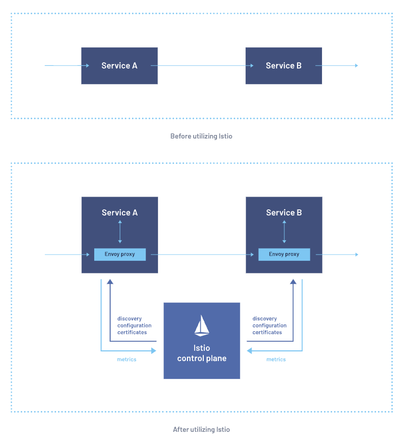

# Istio Service Mesh

## Links
- https://istio.io/latest/about/service-mesh/

## 1 Some Notable Istio Features
- Secure service-to-service communication in a cluster with TLS encryption, strong identity-based authentication and authorization
- Automatic load balancing for HTTP, gRPC, WebSocket, and TCP traffic
- Fine-grained control of traffic behavior with rich routing rules, retries, failovers, and fault injection
- A pluggable policy layer and configuration API supporting access controls, rate limits and quotas
- Automatic metrics, logs, and traces for all traffic within a cluster, including cluster ingress and egress

## 2 How it Works
2 Main Components
1) Data Plane 
- Is the communication between services
- ServiceMesh - Uses a Proxy to intercept all the network traffic
- Envoy Proxy - Is deployed along with each service that is started in the cluster 

2) Control Plane
- Takes desired config (& view of the services) + dynamically programs the proxy servers (updating them as rules/environment changes)

## PICKING UP

What's the difference between?
- Istio Gateway
- ExternalDNS
- Istio (Vanilla)

https://istio.io/latest/docs/setup/getting-started/
https://www.digitalocean.com/community/tutorials/how-to-install-and-use-istio-with-kubernetes
