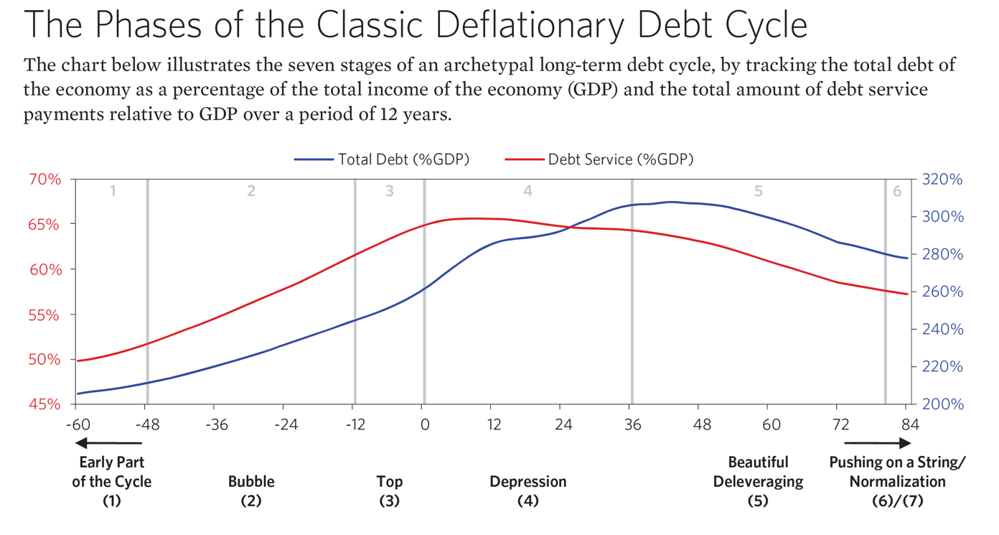
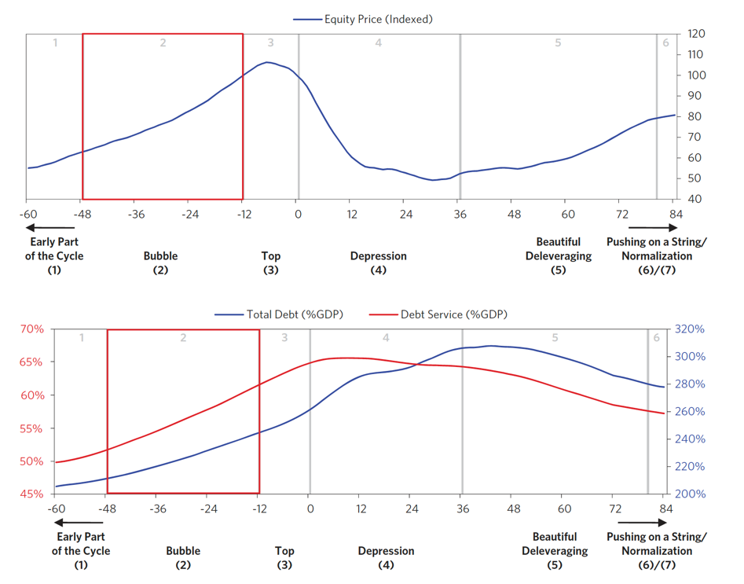
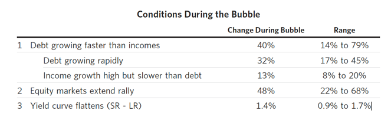
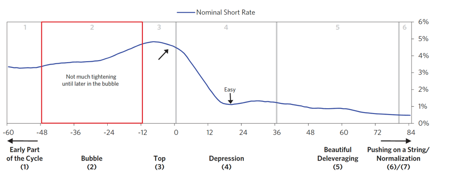
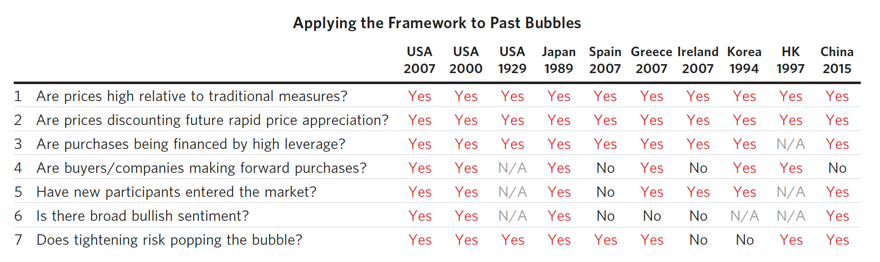
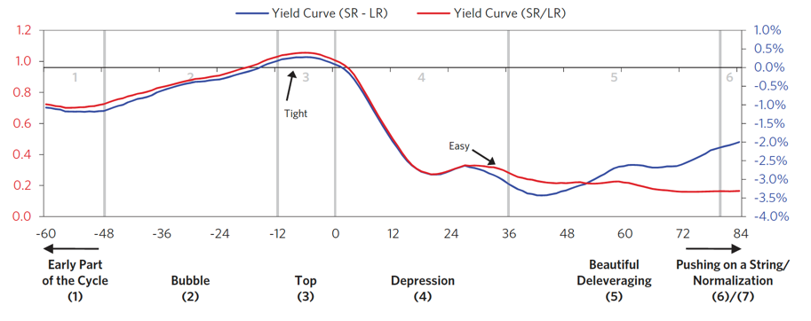

# The Archetypal Big Debt Cycle

## 2.1 | 1 How I think about Credit and Debt

Credit - Giving of Buying Power, a "good thing"
- Why a good thing? Ex. if there is little credit for developement, and there's little development, that's bad.

What determines if rapid credit/debt growth is a good or bad thing?
- What the credit produces?
- How the debt is repaid/serviced?

Because Credit creates both spending power + debt
- More credit is only desirable - If the borrowed money is used productively enough to generate sufficient income to service the debt.

#### How costly is bad debt relative to not having the spending that the debt is financing?
- Really bad debt losses - When ~40% of a loan's value couldn't be paid back
- Bad loans -  20 percent of all the outstanding loans
- Losses - equal to about 8 percent of total debt
- Total debt - equal to about 200 percent of income (e.g., GDP)
- shortfall is roughly equal to 16 percent of GDP. 
- If cost is “socialized” (i.e., borne by the society as a whole via fiscal and/or monetary policies) and spread over 15 years
  - it would amount to about 1 percent per year, which is tolerable. 

#### How can policy makers spread out losses arising from bad debts?
Depends on the following:
- Is debt denominated - In their currency
- If they have influence - Over how creditors/debtors behave with each other

#### Are Debt Crises Inevitable?
- Generally yes.
- Policymakers - Err on being "looser" with credit (due to near-term rewards)
- Also politically easier to allow easy credit (ie. easing monetary policies, providing guarantees, etc.)

#### Why do debt crises come in cycles?
- Take another "version" of Monopoly
- Banks - Can make loans/deposits
- Players borrow this money - And redeposit it at the bank to get interest 
  - This deposited cash - Allows the bank to lend out even more money
- Players can also - Buy/sell properties from each other on credit
----------------------------
#### What happens in this "real" monopoly game?
1) Debt-financed spending - Will grow to multiples of the amount of money in existence
2) Debtors - Will withdraw money from banks to fund more cash
3) Eventually - Both banks/debtors will go broke

#### What can we say about lending?
- Lending - Naturally creates self-reinforcing upward movements that eventually reverse 
  to create self-reinforcing downward movements that must reverse in turn
- During Upswings - Lending supports spending/investment
  - In turn supports incomes/asset prices
  - Increased incomes/asset prices - Support further borrowing & spending on goods/financial assets
  - Borrowing - ***Essentially lifts spending/incomes above consistent productivity growth of economy***
  - Near peak of upward cycle - Lending is based on expectation that above-trend growth indefinitely
  - This won't happen - Eventually income will fall below cost of loans

#### Economies | Depending on Debt-financed building of fixed investments, real estate, infrastructure
- Particularly susceptible to large cyclical swings
- Fast rates of building long-lived assets - Not sustainable
- Because long-lived assets - Initially have high demand, but then taper off (ie. how many buildings does one need?)

#### Classic Bubble Sign
- When an Increasing amount of money is being borrowed - To make debt service payments
  - This Compounds the borrowers' indebtedness

#### Central Banks | Tighten Monetary Policy
- When they realize credit growth is dangerously fast
- When cost of debt service - becomes greater than the amount that can be borrowed to finance spending
  - Upward cycle reverses
- Income growth heavily slows - And asset prices decline

##### Two main long-term problems | From these types of debt cycles
1) Losses arising from expected debt service payments not being made - Couple of options: 
  - Smaller Periodic Payments
  - Writing down Debt's Value - (ie. agreeing to accept less than what was owed)
2) Reduction of lending and the spending it was financing going forward

#### Can most debt crises be managed so that there aren't big problems?
- Worst debt crises - Had Real GDP decline of 3% 
- Can be spread effectively - If debt is denominated in own country's currency

#### 4 Levers Policy Makers Can Use
- Austerity (Spend Less)
- Debt defaults/restructurings
- Central Bank "Printing Money" - Making purchases (or providing guarantees)
- Transfers of money/credit - From less needy (rich) to more needy (poor)

#### Inflationary (Growth Stimulation) Levers
- Central Bank "Printing Money" - Making purchases (or providing guarantees)

#### Deflationary (Growth Reduction) Levers
- Austerity (Spend Less)
- Debt defaults/restructurings

#### "Beautiful Deleveraging"
- Reduction in debt/income rations accompanied by acceptable inflation/growth rates
- Gradually bringing nominal growth rate of incomes back above nominal interest rate

## Template for Archetypal Long-Term/Big-Debt Cycle

NOTE:
- 75% correlation between high foreign debt <=> inflationary depressions

#### When do debt crises typically occur?
- When debt/debt service costs rise faster - than incomes required to service them

#### How can the central bank alleviate typical debt crises?
- Lowering real/nominal interest rates

#### Short-Term vs Long-Term Debt Cycles
- Short-Term Debt Cycle - Produce mini-booms/mini-recessions
- Long-Term Debt Cycles - Produce Big Booms/Busts

### Short-Term Debt Cycles
- Spending is Constrained - Only by willingness of lenders/borrowers to provide/receive credit
  - When Credit is easily available - Expansion
  - When Credit is NOT easily available - Recession 
- What controls the availability of credit? - Central Bank

#### What can we say about each mini-cycle?
- Bottom/Top of each cycle - Finishes with more economic activity + more debt 

#### Big difference between recession/depression?
- Recession - Interest Rates can be lowered
- Depression - Interest Rates can't be lowered anymore (already near 0)

#### Deflationary Depressions
- PolicyMakers - Initially respond by lowering interest rates
- When interest rates reach ~0% - 
  - Debt Restructuring/Austerity Dominate - Without being balanced by adequate stimulation
- Debt burdens rise - Becomes incomes fall faster than restructuring
  - Borrowers - Are required to rack up more debts to cover those high interest costs

#### Inflationary Depressions
- Usually occurs in countries - Reliant on foreign capital flows
  - Lot of debt in foreign currency (can't be monetized) - Meaning central bank can't print money to buy the debt
- When foreign capital stops coming in - Credit creation stops
  - Lending/Liquidity - Slow down
  - Currency declines - Also create inflation
  
- Takeaway (Inflationary Depression)
  - Reduced Credit Creation - Harder to Borrow
  - Currency Declines (relative to foreign currency) - Inflation
  

## Phases of Classic Deflationary Debt Cycle

### 1) Early Part of the Cycle ("Goldilocks Period")
- Debt Growth 
  - Strong
  - Not faster than Incomes
  
### 2) The Bubble
- Debts rise faster than incomes - Produce accelerating strong asset returns/growth
  - Rising incomes, net-worths, assets - Raise borrowers' capacities to borrow
- Debtor's still see rising incomes - Continue with strong lending
- Government - May drop interest rates 
  - Which raises asset prices and people's wealth (because of present value effect that lowering interest rates has on asset prices)
- But this is unsustainable (past a certain point, interest rates = 0%)
  - Eventually - Deleveraging will begin

2a) Start of the Bubble - The Bull Market
- Lower Interest Rates - Make investment assets (stocks/real estate) go up
- Net worths && spending/income levels rise - Increases confidence in ongoing prosperity
- New Buyers (who don't want to miss out) - Enter the market
  - Fuels emergence of the bubble
- Credit Standards fall - New lending vehicles are created

#### The Role of Monetary Policy
1) Often, Monetary Policy - Helps inflate the bubble (versus constraining it)

***What happens when the bubble pops?***
- Falling Asset Prices - Decrease both equity && collateral values of leveraged speculators
  - Causes Lenders to pull back
- Speculators - Forced to sell stocks, which drives prices down even more

Nominal Short Rate - https://www.jstor.org/stable/2329320#:~:text=The%20nominal%20short%20rate%20is,short%20rate%20is%20an%20option.

#### Spotting Bubbles
1) Prices are high relative to traditional measures
2) Prices are discounting future rapid price appreciation from these high levels
3) There is broad bullish sentiment
4) Purchases are being financed by high leverage
5) Buyers have made exceptionally extended forward purchases (e.g., built inventory, contracted for supplies,
   etc.) to speculate or to protect themselves against future price gains
6) New buyers (i.e., those who weren’t previously in the market) have entered the market
7) Stimulative monetary policy threatens to inflate the bubble even more (and tight policy to cause its popping)

- To anticipate a debt crises well - One has to look at specific debt-service abilities of individual entities
  - Lost in above averages
  
### 3) Top
What causes the Top?
1) Central Banks Tightening - Inflation Rates rise
2) Increased Growth/Inflation - While Capacity begins to get constrained

Rise in Short Rates - Narrows/Eliminates spread with long rates
(ie. the extra interest rate earned for lending long term rather than short term)
- Lessens incentive to lend relative to incentive to hold cash

#### Jay's Takeaways | For the layman
1) When interest rates increase - Lending becomes more expensive
2) So stock speculation becomes more expensive - Because increasingly expensive for speculators to buy with leverage
3) 

People are incentivized to move to cash just before the bubble pops

#### BIG MISTAKE | During Bubble Burst 
- When stock prices fall - Earnings have not yet declined
- People MISTAKE this to be a buying opportunity
- BUT... as wealth and incomes fall later - creditworthiness worsens (constricts lending)
- Less appealing to borrow - to buy financial assets
- Then corporate earnings disappoint further - due to weaker economic activity (from expensive lending to buy those assets/goods)
- Then people sell more - Drives down prices further

#### When does the faster rate of tightening typically occur?
- About 5 months prior to the top of the stock market

### 4) The "Depression"
In regular recessions (when monetary policy is effective), 
you can rectify money needed to service debt by cutting interest rates, which
1) Produces positive wealth effect
2) Stimulates economic activity
3) Eases debt-service burdens

At this phase...
1) Deflationary Forces (Debt Defaults + Austerity) - Dominate
2) Inflationary Forces (Debt Monetization, ie. Printing Money) - Aren't sufficient

##### What causes or is the result of the "depression" (phase 4) [2]?
a) Solvency Problems - Bank doesn't have enough equity capital, must be shut down
b) Cash-Flow Problems - Bank doesn't have enough cash, because its own lenders are withdrawing cash (ie. a "run")
- Cash-Flow Problem - Worst because even when there is enough equity capital, much of it can be illiquid

#### Solution(s) to the Solvency Problem (from the "depression" phase) [2]?
- Government - Provides Equity
- Change accounting/regulatory roles

#### Why is lending bad in a depression, even though interest rates are low?
1) As bank "runs" occur - Bank needs to create liquidity somehow
2) Banks - Sell assets + Cut Spending
3) Asset Values Fall - Collateral value also falls

Then Because Borrower's creditworthiness depends on 
1) Asset/Collateral Value - Relative to Debts
2) Income Size - Relative to Debts

and both income + assets/collateral are falling faster than debts, the borrowers are less creditworthy + lenders are more reluctant to lend.

### How are the 4 Levers used during a "depression" (phase 4)?

#### Austerity during "Depression"
1) Need to save critical financial institutions. 2 choices
> a) Government raises taxes/borrows more=
> b) Fed prints more money

#### Debt Defaults/Restructuring
- Nonsystemically important institutions are forced to absorb the losses, and if they fail, allowed to go bankrupt.
  - 80% - Are merged with healthy institutions (ie. Wachovia/Wells-Fargo)
  - 20% - Sold piecemeal by an AMC (Asset Management Company)

Protection Preference
- Small Depositors - Minimal/No Losses
- Equity/Subordinated Debt/Large Depositors - Absorb Losses

Some of the main levers for disposing of nonperforming loans?
- Restructuring - Working out loans through extended terms
- Debt-For_Equity swaps/asset seizures
- Direct sales - Of loans/assets to 3rd parties
- Securitizations

Does printing money cause inflation?
- Not if it offests falling credit/other deflationary forces
- 

#### What's a disadvantage for gold/commodity-pegged money systems vs fiat monetary systems?
- Debt Monetization (printing money) is possible as an inflationary force
- During Great Depression, breaking dollar's gold-peg allowed currency to devalue
  - Key to creating bottoms in stock/commodity marktes
  

## Questions

1) What is debt monetization? What type of force is it? 
- Printing Money. Inflationary

2) What is a Credit Spread?
- Simultaneous Purchase & Sale of two different options in same class/expiration, but with different strike prices.
