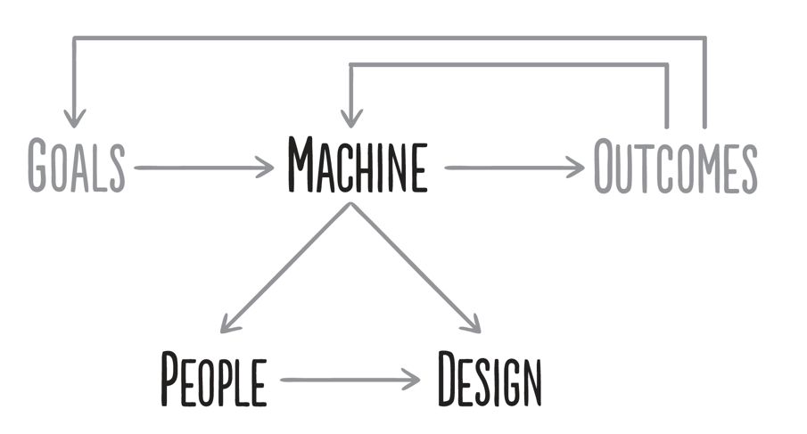

# Introduction/Overview

1)
2)
3)
4)
5)

## 1

# 2 My Most Fundamental Life Principles

## 2.1 | My Most Fundamental Life Principles | Truth

Truth - More precisely, an accurate understanding of reality - is the essential foundation for producing good outcomes
- I believe that the desire to evole, i.e. to get better, is probably humanity's most pervasive driving force
- I believe that pursuing self-interest in harmony with the laws of the universe and contributing to evolution is universally rewarded,  and what I call "good"
  - Look at all species in action: they are constantly pursuing their own interests and helping evolution in a symbiotic way
  
- That is why how much money people have earned is a rough measure of how much they gave society what it wanted - NOT how much they desired to make money. 
- Look at what caused people to make a lot of money and you will see that usually it is in proportion to their production of what society wanted and 
largely unrelated to their desire to make money.

## 2.2 | My Most Fundamental Life Principles | Evolution, Success
  
- So,  it seems to me that desires to evolve are universal and so are symbiotic relationships 
that lead to the evolution of the whole via the pursuit of individuals' self-interests.
However, what differentiates man from other species is man's greater ability to learn. 
Because we can learn, we can involve more and faster than other species. 

- We all have things that we value that we want and we all have strengths and weaknesses that affect our paths for getting them.
**The most important quality that differentiates successful people from unsuccessful people is our capacity to learn and adapt to these things.** 
  
***Reality + Dreams + Determination = A Successful Life***

2 Paths to Happiness: 
1) Have high expectations and strive to exceed them
2) Lower your expectations so that they are at or below your conditions

Another principle to keep in mind is that people need meaningful work and meaningful relationships in order to be fulfilled. 

## 2.3 | My Most Fundamental Life Principles | Your most important choices

- 5 big choice types - That we continually must make that radically affect the quality of our lives and the rates at which we move toward what we want

### Choice #1 | Pain
- It is a fundamental law of nature that to evolve one has to push one's limits, which is painful, 
in order to gain strength - whether it's in the form of lifting weights, facing problems head-on, or in any other way
- 1a) Bad - Allow pain to stand in the way of progress
- 1b) Good - Understand how to manage pain to produce progress

- Since the only way you are going to find solutions to painful problems is by thinking deeploy about them (ie. reflecting)
if you can develop a kneww-jerk reaction to pain that is to reflect rather than to fight or flee, it will lead to your rapid learning/evolving.

***Pain + Reflection = Progress***
- How big of an impediment is psychological pain to your progress?

### Choice #2 | Facing Harsh Realities
- People who confuse what they wish were true with what is really true create distorted pictures of reality that make it impossible for them to make the best choices. 
They typically do this because facing "harsh realities" can be very difficult. However, by not facing these harsh realities, they don't find ways of properly dealing with them.
And because their decisions are not based in reality, they can't anticipate the consequences of their decisions. 
- **In contrast, people who know that understanding what is real is the first step toward optimally dealing with it make better decisions**

***Ask yourself, "Is it true"***
- because knowing what is true is good.
- How much do you let what you wish to be true stand in the way of seeing what is really true?

### Choice #3 | How much do you worry about looking good relative to actually being good?
- **People who worry about looking good typically hide what they don't know and hide their weaknesses, so that they never learn how to properly deal with them and these weaknesses remain impediments in the future**
- **People who are interested in making the best possible decisions rarely are confident that they have the best possible answers**

### Choice #4 | Consequence Order Matters
- **People who overweight the 1st-order consequences of their decisions and ignore the effects 
   that the 2nd & subsequent-order consequences will have on their goals rarely reach their goals.**
  
***How much do you respond to 1st order consequences at the expense of 2nd & 3rd order consequences?***

### Choice #5 | Accountability
- Blaming bad outcomes on anyone or anything other than one's self is essentially wishing that reality is different
than it is, which is silly. And it is subversive because it diverts one's attention away from mustering up the 
personal strength and other qualities that are required to produce the best possible outcomes.
  
- **Successful people understand that bad things come at everyone and that it is their responsibility 
to make their lives what they want them to be by successfully dealing with whatever challenges they face**
  
- ***How much do you let yourself off the hook rather than hold yourself accountable for your success?***

### Summary
- ***In summary, I believe that you can probably get what you want out of life if you can suspend your ego 
and take a no-excuses approach to achieving your goals with open-mindedness, determination, and courage,
especially if you rely on the help of people who are strong in areas that you are weak.***

- **If I had to pick just one quality that those who make the right choices have, it is character.
Character is the ability to get one's self to do the difficult things that produce the desired results.*   

## Your Two Yous and Your Machine

1) Those who are the most successful are capable of "higher level thinking" - 
ie. they are able to step back and design a "machine" consisting of the
right people doing the right things to get what they want. 
   
2) Your goals will determine the "machine" that you create to achieve them.

3) That machine will produce outcomes that you should compare with your goals 
to judge how your machine is working.
   

## 2.4 The 2 Yous
1) You - Designer/Maintainer of the machine
2) You - Participant in the machine

Don't let You (#2) get in the way of what You (#1) want.

- *How much do you intellectually agree with what I just said?*
How good are you in approaching life as a "higher level thinking" rather than as a doer?

## 2.5 My 5-Step Process to getting what you want out of life

1) Choose your goals
2) Design Plan - To Achieve your goals
3) Encountering Problems - Will cause pain, forcing you to explore strengths & weaknesses. Either 
  - React badly to the pain
  - React like a master problem solver

### High-Level Overview
Have clear goals. Identify and don't tolerate the problems that stand in the way of achieving your goals. 
Accurately diagnose these problems. Design plans that explicitly lay out tasks that will get you 
around your problems and on to your goals. Implement these plans - ie. do these tasks

### Caveats of the 5-Step Process
1) Approach tasks as distinct steps - Rather than blurring together. 
- Blurring the steps leads to suboptimal outcomes because it creates 
confusion and short-changes the individual steps. Doing each step thoroughly will provide information that will help you do the other steps well, **since the process is iterative**

2) Each of these 5 steps requires different talents and disciplines
- If you are missing any of the required talents/disciplines, 
that is not an insurmountable problem because you can acquire them, supplmement them, 
or compensate for not having them, if you **recognize your weaknesses and design around them** 

3) It is essential to approach this process in a very clear-headed, rational way rather than emotionally.
- By and large, life will give you what you deserve and it doesn't give a damn what you "like"
- So it is up to you to take full responsibility to connect what you want with what you need to do to get it, 
and then to do those things - which often are difficult but produce good results, so that you'll 
then deserve to get what you want. 
  

### The 5 Steps Close-Up

#### 1) Setting Goals - **You can have virtually anything you want, but you can't have everything you want**
- Doesn't really matter if some things are unavailable, because selection of what is available is so great.
- To achieve your goals you have to prioritize, and that includes rejecting good alternatives

#### Goals vs Desires
- Goals - Things that you really want to achieve
- Desires - Things that you want that can prevent you from reaching your goals

#### Avoid setting goals based on what you think you can achieve
- As said before, do each step separately and distinctly without regard to the others
- Don't rule out a goal due to a superficial assessment of its attainability
- This requires some faith that you really can achieve virtually anything, 
even if you don't know how you will do it at the moment. 

#### Your goal is always to make the best possible choices, knowing that you will be rewarded if you do.
- It's like playing golf; sometimes you will be in the fairway and sometimes you will be in the rough, so you have to know how to play it as it lies.

- *How well do you know what you want most out of life?*
- *What are your most important goals?*
- *Are you good at setting your goals?*
- *How confident are you that your assessment of your ability to set goals is right?*
- *If you are confident of your self-assessment, why should you be confident (eg. because you have a demonstrated track record, because many believable people have told you, etc.*

#### 2) Identifying and not Tolerating Problems 

- Identify and not Tolerate Problems  - **Most problems are potential improvements screaming at you**
- The more painful the problem, the louder it is screaming. In order to be successful, you have to 1) perceive problems and 2) not tolerate them.

- *While it can be tempting to react emotionally to problems and seek sympathy or blame others, this accomplishes nothing.*
- Whatever the reasons, you have to get over the impediments to succeed. 
- Remember that the pains you are feeling are "growing pains" that will test your character and reward you if you push through them.
- *Try to look at your problems as a detached observer would*

- ***Be very precise in specifying your problems***
- ***Don't confuse problems with causes***
- ***Once you identify your problems, you must not tolerate them***

- ***Can you make a list of problems, without thinking of how to solve them?***

#### 3) Diagnosing the Problems
- **You will be much more effective if you focus on diagnosis and design rather than jumping to solutions**
- **You must get at the root causes**

Root vs Proximate Causes
- Proximate Causes ("verbs") - Actions or lack of actions that lead to problems 
  - "I missed the train because I didn't check the train schedule"
- Root Causes ("adjectives") - Deeper reasons behind the proximate cause, usually characteristics about an individual
  - "I didn't check the schedule because I am forgetful"

***Pain + Reflection = Progress***

- From Management Principles:
  - In diagnosing problems, how willing are you to "touch the nerve"? (ie. discuss your and others possible mistakes and weaknesses with them)
  - Are you willing to get at root causes, like what people are like?
  - Are you good at seeing the patterns and synthesizing them into diagnoses of root causes?
  - How confident are you that your assessment of your ability to diagnose is accurate?
  - If you are confident of your self-assessment, why should you be confident (eg. because you have a demonstrated track record, because many beliavable people have told you, etc.)?
  
#### 4) Designing the Plan (Determining the Solutions)

Design - May occur at 2 stages
1) Goal-Setting
2) Problems - On your way to your goals

Write a story (or plan) - Essential to visualize the story of where you have been (or what you have done) that
has led you to where you are now and what will happen sequentially in the future to lead you to your goals. 
You should visualize this plan through time, like watching a movie that connects your past, present, and future.

Then write down the plan so you don't lose sight of it, and include who needs to do what and when.
- Tasks (Step #4) - Fall out from the story, but are not the same.
- The story (or plan) connects your goals to your tasks.
- To succeed with the tasks - Must not lose sight of goals/story (constantly refer back)

When Designing the plan 
- Think about timelines of various interconnected tasks.
  1) Sketch out broad steps
  2) Fill in specific tasks (with estimated timelines) that have implications (cost, time, etc.)
  
People successful with this stage have an **ability to visualize** and a **practical understanding** of how things really work.

#### 5) Doing the Tasks
- **I believe the importance of good work habits is vastly underrated**
- **It is critical to know each day what you need to do and have the discipline to do it**

People good at this stage can reliably execute a plan. 
- Tend to be - **Self-Disciplined** and **Proactive** - Rather than reactive to the blizzard of daily tasks that can divert them from the execution/.
- If daily tasks protract from plan execution - Diagnose and design how they can deal with BOTH daily tasks + moving forward with the plan.

### Relationships between These Steps
1) Designs + Tasks - No purpose other than to achieve goals. 
2) TRAP - Don't do tasks without forgetting the GOALS (else can fail to achieve goals)
3) Your goals must be riveted in your mind - They are the things you MUST do

For Success!!
- Achievers - Rigid with goals, flexible with tasks/design
- Non-Achievers - Flexible with goals, rigid with tasks/design

**What do you think is the biggest weakness you have that stands in the way of what you want - the one that you repeatedly run into?**

More specifically, which of the 5 steps are you bad at?

## 3 Management Principles

To make a great org, you need 2 components:
1) Great People
2) Great Culture

## 4

## 5
