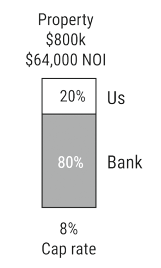

# 

## Section 3 |

### 17 Residential Investing

1) "Owner Occupant"  - When you buy a house, live there for a year, then move out and rent it 
  - Tax Advantage

Pros:
- Monthly Cash Flow
- Home Value increases long term
- Tenants pay off mortgage
- Use bank's money to buy your house
- Low/no money down programs
- Tax Benefits
- Residual Income w/ little effort

Cons:
- Tenant Risk
- Slow Snowball
- Small amounts of cashflow

### 18 Commercial Investing

***Underwriting*** - Analyze property to ensure cash-flow positivity

Disadvantage - Much smaller loan size (vs. residential real estate)

Pros:
- Much larger profit potential
- Control property worth - based on income
- Enough income - For responsibility delegation
- Multiple tenants - Income diversification
- Greater Value - Added Opportunity

Cons:
- Scary for new investors
- Higher upfront cash - For purchase

### 19 Development

Pros:
- Lot of money if done right (ie. rent, not sell)
- Self-control over desired investment (where and what)
Cons:
- Many moving parts
- Long process
- Uncertainty
- Requires education
- Not always investing depending on business plan/strategy

## Section 4 | Benefits of Real Estate Deep Dive

### 20 Cash Flow is King

1) Cash Flow > Cash

2) Example, don't take $50k and buy a Porsche
- Buy a house for $50k, and use the rent to pay off your Porsche

### 21 Property Appreciation
- Fix up your place to charge more rent

### 22 Use Your Investment

### 24 Make Inflation Your Friend
- Monthly Mortgage Payments - Are Fixed
- Monthly Rent Checks - Will go up with Inflation

## Section 5 | Residential Vs Commercial

### Commercial vs Residential Risk

Commercial less Risky than Residential
- Because diversification via tenants - Multiple tenants is less risky than single tenant

### 27 Control Your Value

- Commercial Real Estate
- Valued off how much money it makes
- If we can raise value of it - it's worth more

## Section 6 | Valuing Commercial Property

### 28 NOI (Net Operating Income)

- 2 Main factors that impact value of commercial real estate
- NOI = Income - Expenses
- Cash Flow = NOI - DebtService (Mortgage Payment)
- Cash Flow = Income - Expenses - DebtService (Mortgage Payment) 

#### Difference between NOI && Cash Flow?
- CreditWorthiness
- Somebody with better credit will be able to make lower interest payments, therefore higher cash flow

### 31 Determining Value

- How to determine level of return for the property?
  - NOI/return
  - Ex. For 10% return, NOI $60,000, => Value = $60,000/10% = $600,000
  
- What also determines Value?
  - Riskiness of Real Estate (For ex. in remote working, apartments are cheaper than residential)

### 32 Cap Rate

- "Cap Rate" - Is the % that we are dividing the NOI by 
- Buying Property - High Cap Rate
- Selling Property - Low Cap Rate

Low Cap Rate = Lower Risk = Every NOI Dollar is more valuable
High Cap Rate = Higher Risk = Every NOI Dollar is less valuable

Note, 1% difference gets bigger the lower you go

Pro Tip: Commercial Property Brokers only post CAP Rate + NOI on a property (Buyer should extrapolate purchase price)
- If Buyer asks for purchase price - They are a NOOB

## 33 Determining Your Cap Rate
Factors determining Cap Rate:
1) Location
2) Type
3) Age
- Older Properties are Riskier
4) Property Class
- A-D 
- A - Desirable (Low Cap Rate)
- D - Undesirable (High Cap Rate)
5) RE Market
- More Buyers - Higher Price
- Fewer Buyers - Lower Price 
6) Interest Rates
- Lower Interest - Low Cap Rates
- High Interest - High Cap Rates

### 34 Power of the Cap Rate

Example:
- Apartment Unit that charges $25 a month to take trash out every night
- 196 Units at complex, so 196 x $25 x 12 months = $58,800
- Labor Cost - $20 x 2 hours x 365 = $14,600
- NOI = %58,800 - $14,600 = $44,200

Value = $44,200/6% = $736,667

## Section 7 | Tax Benefits

### 35 Why Real Estate Investors Get Tax Benefits
- Because they house/help people

### 36 Depreciation Is Your Friend
- Depreciation Amount 
  - Residential - 27.5 years
  - Commercial - 39 years
- What does the Depreciation amount entail?
  - How much $ we get to take home tax-free
  

NOTE: 
- When "Basis" (Purchase_Amount - Depreciation Amount per year) reaches 0, no more tax benefits
- You cannot depreciate land

### 37 Depreciation Steroids
- Accelerated Depreciation - Hire a Professional who says certain parts of house are depreciating faster
- "Cost segregation study real estate"

### 38 Tax Free Property Swap

1031 Exchange

- When selling property, tax is on Sale Proceeds - Current_Basis.
 - Ex. If our $1m property only has $100 basis left
 - And we sell it for $1.5m
 - We have to pay taxes on $1.5m - $100k basis = $1.4m

- If you buy property w/ your sale proceeds
  - No taxes on gains
  
1031 Caveats
- 45 Days to identify a replacement property (Can only identify 3 potential properties)
- Replacement Property - Has to cost more than property you sold
- 180 days to actually buy the property

### 39 REFI (Refinance) Till You Die

Recall - Assets = Debts + Equity

#### $1m example
- We put down $200k, bank puts down $800k
- After 5 years, Property = $1.2m, Debt = $700k (because you're paying it off)
- What is our Equity?
  - Assets - Debt = Equity
  - Equity = $1.2m - $700k = $500k

#### Refinancing
- Banks will give loans on properties we already own

 

- Your Monthly payments go up (and therefore cash flow goes down)
- But, it's tax free. How long would it have taken to get $290,000 from the delta?
- $290,000 / $10,000 = 29 Years

### 40 Interest Write Off

## Section 8 Debt

Definitions:
- Balance - How much you owe the bank if you were to pay it off now
- Payment - Also called Mortgage Payment, debt service. Amount you pay to the bank each month
- Principal - Money that goes towards paying off the loan each payment
- Interest - Money that the bank keeps as profit in each payment
- Amortization - How long it takes to pay off the loan
- Points - The up front fee for the loan
- Balloon - When is the loan amount due?
- LTV - Loan to Value. Simply saying what % of the property value will the bank give us as debt

### 41 How a Loan Works

Total Payment = Interest Payment + Principal Payment

### 42 Interest Rates

How does amortization affect interest rates?
- High Amortization (Long Time) - High Interest Rate
- Low Amortization (Short time) - Low Interest Rate

### 43 Amortization
- 10-35 Years
- Is it better to have a high or low Amortization?

### 44 Balloons
- Basically when interest rates rise, banks want to reset their loan to the new interest rate
- So they immediately demand the money
  - You can't pay it off right there, so you have to file for a new loan
    - This new loan will be at the new interest rate

- Balloon - Reset point for the Loan (at the new interest rate)
  - NOTE - If banks have no money (ie. in 2008), you may be screwed
  
- What we want - Balloon payment that is far away

#### Fully Amortizing Loan
- Loan with no Balloon (you just pay the mortgage per month)

### 45 Types of Loans
1) Traditional Loan 
2) Interest-Only Loan - You only pay the interest rate
  - So for 5% interest, $100k loan, over 10 years:
    - We pay $5k a year (for interest)
    - After 10 years - Pay $100k
3) Variable-Rate Loan
  - Usually - Some Interest-Rate Index + some percent
  - Ex: Fed_Fund_Rate + 2%
    - So if Fed rate is 1% this, year =>  3% Rate (1%+2%)

Interest-Only Loan:
- Benefits - High Cash Flow (Not paying principal down)
- Cons - No Equity Buildup over time

### 46 Points
- Fees you pay bank (as a percentage point)
  - For $100k loan - 1 point fee = $1k, 1.5 point fee = $1.5k etc.
- Don't necessarily squeeze the bank out of the points (or else how hard will they fight for you)?

### 47 LTV (Loan-To-Value)
- LTV = LoanAmount/PropertyValue
- Bank vs you: Bank gets access to all money up to the loan
  - But they don't get to share in the profit upsides
  
## Section 7 Underwriting an Investment

### 48 Analyze the Property

Underwriting - Basically analyzing
- Specifically, analyzing - income, expenses, NOI, debt service, cash flows, overall performance, etc.

- Real Estate - 2 Statements to be aware of
  1) Income Statement - Also known as Profit & Loss (P & L)
  2) Balance Sheet - View the following:
      - How much the property is worth
      - How much debt is on that property
      - Extrapolate Equity - From Property/Debt worth
      - How much cash a property has available - For unexpected expenses
  
### General Order of Calculations | Determine the following (In Order)
1) NOI = Income - Expenses
2) Value = NOI/CapRate
3) DebtBalance = Value * LTV 
4) Equity = Value - DebtBalance
--------------------------
5) Debt (Mortage per year) = PMT(Interest%, AmortizationRate, DebtBalance)
  - So for 30 year loan, interest 5%, w/ 800k debt balance -> PMT(0.05,30, -800000) = $52,041

#### Year 2 Calculations
0) Add Inflation - 2% to Income && Expenses
1) NOI - Now $61,200 (Because our income grows larger than our expenses)
2) Value - Now $1,020k vs $1000k (Additional $20k due to inflation)
 
#### Income Statement/Balance Sheet

#### Proforma Calculation

### 49 Value Add Investing

Currently, rent per unit is $833, but we'd like to add value so we can get $1000 instead.

## Section 10 Understanding Returns

### 50 Make A Decision
### 51 Time And Money
### 52 Internal Rate of Return (IRR)
IRR (Internal Rate of Return)
### 53 Cash on Cash
CashOnCash = AnnualCashFlow/Equity

#### CashOnCash Example

- Even though the annual cashflow is less in Option #2 ($3000 less)
  - The CashOnCash is better
  
- What does CashOnCash tell us? 
  - How to optimize our cash flow for the money we do have
  
### 54 Adding Tax Benefits to your Returns
- Scenario 1: Land with 12% return
- Scenario 2: Apartment Units with 10% return, but...50% taxable income depreciation

### 55 How Leverage Affects Your Returns

#### How do we find out what the bank is going to get?
Mortgage_Constant = 12x MonthlyPayments / LoanAmount

#### Example
If we borrowed $100k, and monthly payment was $952, what is the mortgage constant?

Mortgage_Constant = 12x$952/ $100k
Mortgage_Constant = $11,424 / $100k
Mortgage_Constant = 11.42%

 #### How do determine if a project is profitable or not? Any other quicker ways?
- Projects's return should be higher than 11.42%
- See if cap rate is higher than mortgage constant
  - With no debt, ***cap rate*** will be equal to ***cashoncash***

### 56 Conclusion on Returns

## Section 1 Putting it all together

### 57 Free Real Estate

Example Scenario:
- Current NOI $64k
- 8% cap rate
- Purchase price $800k (64k/0.08 = $800k)

- Bank - Willing to loan 80% of project at 5% interest on 30 year Amortization
  - Long balloon Period

#### Bank Balance Note
- Factor in potential improvements and ask bank to foot 80% of improvement costs as well
- If you improve the building, improve tenants, etc.
  - Can get a lower cap rate, boosting Property Value

# Questions
1) NOI?
 - Income - Expenses
2) Cashflow?
 - NOI - DebtService (Mortgage Payment)
3) Why does CashFlow change from individual to individual?
  - Creditworthiness. Different people will have to pay different debt service (ie. mortage) rates
4) What is Cap Rate formula, and what is it used to determine? 
  - NOI/CapRate = Value
5) What are some factors that determine cap rate [6]?
- Location, Type, Age, Property Class, RE Market, Interest Rates
6) What is the depreciation rate, and how long is it for commercial and residential real estate?
- How much "value" your property loses a year. 27.5 residential, 39 commercial. 
7) Formula for finding yearly depreciation (Residential Vs Commercial)?
- Residential = Purchase_Price/27.5
- Commercial = Purchase_Price/39
8) Caveat for depreciation (specifically with property sale)?
- Sale Tax = Selling Price - Remaining Basis. So if you depreciate a lot, high tax bill.
8) What does a 1031 Exchange allow you to do?
- Avoid taxes on property sale by allowing you to buy another property.
9) Caveats for 1031 Exchange [3]?
- 45 Days to identify a replacement property (Can only identify 3 potential properties)
- Replacement Property - Has to cost more than property you sold
- 180 days to actually buy the property
10) Refinancing
  - a) Rough Overview?
- Allows you to take out a loan on a property you already own. 
  - If you refinance a property that you took a loan out on after 5 years
    - It will be whatever % of property's current value - Old_loan
  - b) Advantages?
    - Get Tax-free cash immediately
  - c) Disadvantages?
    - Cash Flow goes down from higher mortgage 
  
11) What are some general Real Estate Tax Advantages?
  - Interest - Write off Interest (you pay bank) from income tax
  - Depreciation - How much your property depreciates per year (you get to keep that amount tax-free per year) 
  - 1031 Exchange - Allow tax-free profit from property sale to be used for purchasing another property

12) What do the following mean?
- Balance - How much you owe the bank if you were to pay it off now
- Payment - Also called Mortgage Payment, debt service. Amount you pay to the bank each month
- Principal - Money that goes towards paying off the loan each payment
- Interest - Money that the bank keeps as profit in each payment
- Amortization - How long it takes to pay off the loan
- Points - The up front fee for the loan
- Balloon - When is the loan amount due?
- LTV - Loan to Value. Simply saying what % of the property value will the bank give us as debt

13) What's a big misconception regarding loan payments?
- People think they're linear (They're not). 
- As the Balance reduces, so does the interest.
- So over time, for a fixed loan payment:
  - Principal Payment - Goes Up
  - Interest Payment - Goes Down

14) How does amortization affect interest rates?
- High Amortization (Long Time) - High Interest Rate
- Low Amortization (Short time) - Low Interest Rate

15) What is a balloon? What is the advantage for the bank?
- "Partially Amortized Loan". Large payment to be made at end of a Loan Cycle.
- For banks, allows them to "reset" the interest rate by refinancing the loan.

16) What is a loan with no balloon called?
- "Fully Amortized Loan"

17) What are the primary types of loans available [3]? Rough Overview of each
  - Traditional Loan
  - Interest-Only Loan - No Down payment due, just pay full amount at end
  - Variable-Rate Loan - Rate changes w/ some index (usually fed fund rate)

18) What combination of factors determine success in the RE Market [3]?
  - Cash flows from a property, value of the property, how you finance the property

19) What is a point refer to? How do you calculate it?
- Upfront fee you pay the bank. 1 point = 1% of loan.

20) What does LTV refer to? Formula? To what amount does it generally go up to?
- LTV (Loan-To-Value) = LoanAmount / PropertyValue. Up to 80%.
    
21) When underwriting a property, what two main docs are needed? Formula for each?
  - Income Statement:
    - NOI = Income - Expenses
    - CashFlow = NOI - Debt 
  - Balance Sheet:
    - Equity = Property Value - Debt Balance 

22) General Order for Underwriting [6]?
- 1) NOI = Income - Expenses
- 2) Value = NOI/CapRate
- 3) DebtBalance = Value * LTV
- 4) Equity = Value - DebtBalance
- 5) Debt (Mortage per year) = PMT(Interest%, AmortizationRate, DebtBalance)
  - So for 30 year loan, interest 5%, w/ 800k debt balance -> PMT(0.05,30, -800000) = $52,041
- 6) Cashflow

23) What does "Equity" really refer to? What is it initially?
- How much money we have in the property. Initially, your part of the money (not bank's) to purchase the property.

24) What are some different metrics you can use [2]?
- IRR, CashOnCash

25) CashOnCash Formula? What does it tell us? When is it good?
- CashOnCash = AnnualCashFlow/Equity
- Tells us how to optimize cash for the money we do have
- When you want to build a lot of cashflow

26) What's 1 benefit of purchasing units over land?
- Depreciation cost
